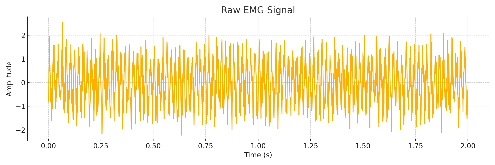
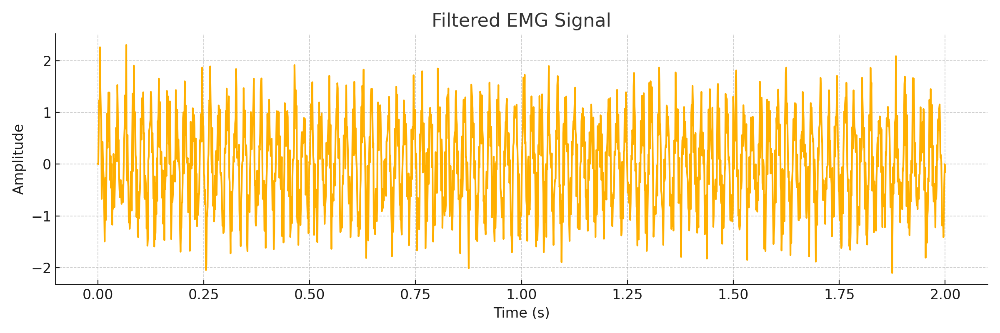
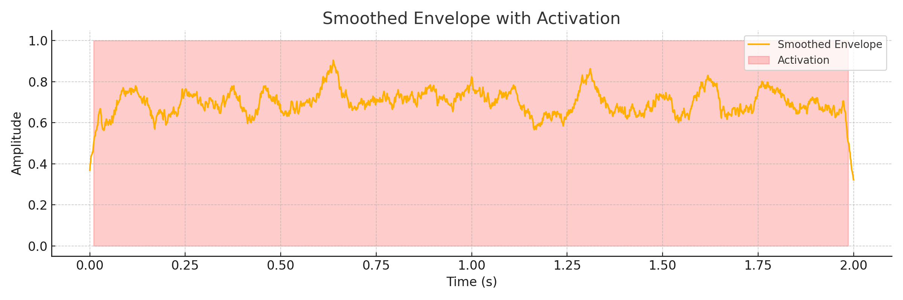

# 📊 EMG Processed Data

This folder contains example EMG signal data generated for visualization, validation, and system testing.

## 🧾 File: `emg_processed_data.csv`

| Column Name | Description |
|-------------|-------------|
| `time_s`    | Time in seconds |
| `raw_emg`   | Original EMG signal with noise |
| `filtered`  | Bandpass filtered EMG (20–450 Hz) |
| `smoothed`  | Envelope signal from moving average |
| `activation`| Binary value (1 if signal > threshold) |

This data can be used to:
- Test activation threshold detection logic
- Train and evaluate signal classification models
- Simulate EMG-driven actuator control in the exoskeleton

# 🖼 EMG Signal Visualizations

This folder contains key visualizations derived from processed EMG data.

## 📷 Image Previews

### 1. Raw EMG Signal

### 2. Bandpass Filtered EMG

### 3. Smoothed Envelope with Activation Threshold

---

These images are generated using signal processing scripts provided in `firmware/signal_processing/` and correspond to the dataset located in `data/emg_processed_data.csv`.

